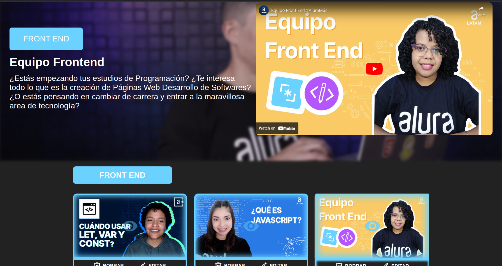
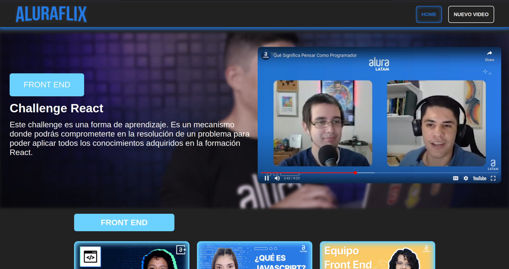
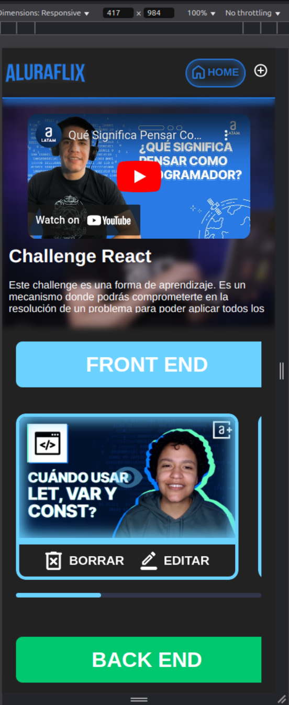

# Oracle ONE - AluraFlix Challenge
## Javier Montes Carrera

## Introducción

Aluraflix es un proyecto desarrollado como parte del desafío de Oracle ONE. Este proyecto es una plataforma de streaming de videos que permite a los usuarios videos de Alura Latam. 

## Tecnologías y técnicas utilizadas

### Tecnologías

* **React**: Biblioteca de JavaScript para crear interfaces de usuario.
* **TypeScript**: Lenguaje de programación para escribir el código.
* **React Router**: Biblioteca para gestionar la navegación entre diferentes rutas y páginas.
* **Material-UI**: Biblioteca de componentes de interfaz de usuario para crear una interfaz de usuario consistente y atractiva.
* **CSS**: Lenguaje de estilos para personalizar la apariencia de la interfaz de usuario.
* **JavaScript**: Lenguaje de programación para escribir la lógica de negocio y gestionar los eventos de la interfaz de usuario.

### Técnicas

* **Componentes funcionales**: Componentes reutilizables y fáciles de mantener.
* **Hooks**: Gestionar el estado y los efectos secundarios en los componentes.
* **Responsividad**: Diseño y desarrollo para que la interfaz de usuario sea adaptable y se ajuste a diferentes tamaños de pantalla.
* **Context API**: Compartir datos entre componentes y evitar la propagación de props.
* **Modularización**: Estructura de carpetas y archivos modularizados para organizar el código y facilitar su mantenimiento.
* **Separación de concerns**: Separación clara entre la lógica de negocio, la interfaz de usuario y la gestión de estado.

## Estructura del proyecto

* **src**: Carpeta que contiene el código fuente del proyecto.
* **components**: Carpeta que contiene los componentes de React utilizados en el proyecto.
* **context**: Carpeta que contiene la implementación de la Context API de React.
* **pages**: Carpeta que contiene las páginas del proyecto.
* **routes**: Carpeta que contiene la configuración de las rutas del proyecto.
* **styles**: Carpeta que contiene los archivos CSS utilizados para estilar la interfaz de usuario.

---

### Inicio - Desktop:

---

### Se puede seleccionar cualquiera de los videos para reproducirlo:

---

### Reproducción de videos:

---

### Inicio - Tablet:

---

### Inicio - Mobile:

---

### Nuevo Video:

---

### Nuevo Video - Mobile:

---

### Editar Card:

---

### Editar Card - Mobile:
